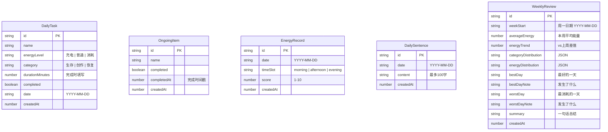

# 橘猫 — 看见自己的能量 技术架构文档

## 1. 架构设计

纯前端应用，所有数据存储在浏览器 localStorage 中，不依赖后端服务。

```mermaid
flowchart TD
    "React 前端应用" --> "Zustand 状态管理"
    "Zustand 状态管理" --> "localStorage 持久化"
    "React 前端应用" --> "React Router 路由"
    "React 前端应用" --> "Tailwind CSS 样式"
```

## 2. 技术说明
- **前端**：React 18 + TypeScript + Tailwind CSS 3 + Vite
- **初始化工具**：vite-init
- **后端**：无（纯前端应用，本地存储）
- **数据库**：localStorage（浏览器本地存储）
- **状态管理**：Zustand（含 persist 中间件自动同步 localStorage）
- **路由**：React Router DOM v6

## 3. 路由定义

| 路由 | 用途 |
|------|------|
| `/` | 重定向到 `/today` |
| `/today` | 今日任务页 |
| `/ongoing` | 进行中页 |
| `/energy` | 能量记录页 |
| `/sentence` | 每日一句话页 |
| `/review` | 周复盘页 |

## 4. 数据模型

### 4.1 数据模型定义



### 4.2 数据定义语言（localStorage Schema）

```typescript
// 每日任务
interface DailyTask {
  id: string;
  name: string;
  energyLevel: 'charge' | 'normal' | 'drain'; // 充电 | 普通 | 消耗
  category: 'survival' | 'creation' | 'recovery'; // 生存 | 创作 | 恢复
  durationMinutes?: number; // 完成时填写
  completed: boolean;
  date: string; // YYYY-MM-DD
  createdAt: number;
}

// 进行中事项
interface OngoingItem {
  id: string;
  name: string;
  completed: boolean;
  completedAt?: number;
  createdAt: number;
}

// 能量记录
interface EnergyRecord {
  id: string;
  date: string; // YYYY-MM-DD
  timeSlot: 'morning' | 'afternoon' | 'evening';
  score: number; // 1-10
  createdAt: number;
}

// 每日一句话
interface DailySentence {
  id: string;
  date: string; // YYYY-MM-DD
  content: string; // 最多100字
  createdAt: number;
}

// 周复盘
interface WeeklyReview {
  id: string;
  weekStart: string; // 周一日期 YYYY-MM-DD
  averageEnergy?: number;
  energyTrend?: number;
  categoryDistribution?: Record<string, number>;
  energyDistribution?: Record<string, number>;
  bestDay?: string;
  bestDayNote?: string;
  worstDay?: string;
  worstDayNote?: string;
  summary?: string;
  createdAt: number;
}
```

## 5. 状态管理设计

使用 Zustand 创建多个独立 store，每个 store 负责 一个模块的数据：

- `useTaskStore`：今日任务 + 数据清理逻辑
- `useOngoingStore`：进行中事项
- `useEnergyStore`：能量记录
- `useSentenceStore`：每日一句话
- `useReviewStore`：周复盘

每个 store 使用 `persist` 中间件自动同步 localStorage。

## 6. 关键业务逻辑

### 6.1 每日任务自动清空
- 应用启动时检查当前日期，与任务 date 对比
- 非当天的未完成任务直接删除
- 已完成超过7天的任务删除

### 6.2 能量记录时间点
- 起床能量：检查当前时间是否在 6:00-10:00 之间提示
- 下午能量：14:00 提示
- 晚间能量：20:00 提示
- 均为应用内温和提示，非推送通知

### 6.3 周复盘自动计算
- 本周平均能量：本周所有能量记录 score 的平均值
- 能量趋势：本周平均 - 上周平均
- 任务分类分布：统计本周已完成任务的 category
- 耗能等级分布：统计本周已完成任务的 energyLevel

### 6.4 进行中事项清理
- 完成后保留30天，超期自动删除
